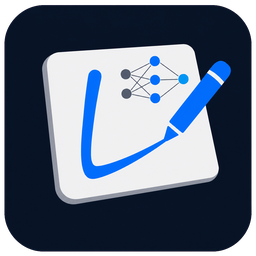
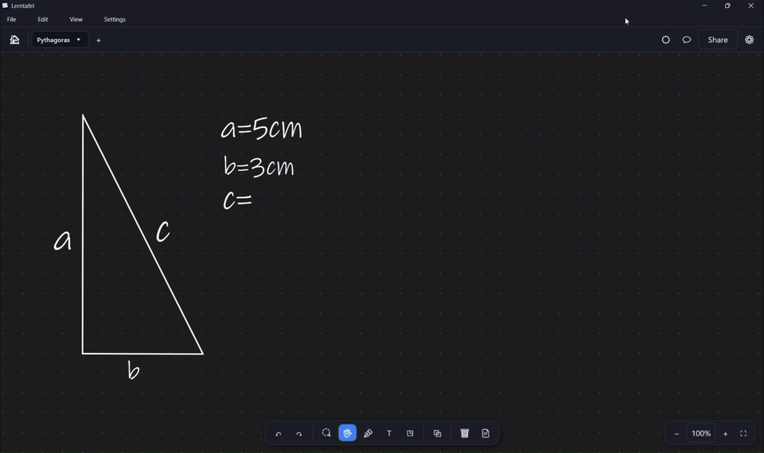

  

<h1 align="center">Lerntafel</h1>

  <b>An infinite whiteboard for Windows with pen support — and an AI that draws along with you, right on the board.</b>

  
  
  
  

Most whiteboard apps put the AI in a chat panel beside the board. Lerntafel's AI **writes and draws on the board itself** — the next line of a calculation, a corrected step, a labelled circuit diagram — the same way a tutor would with a pen. Built for maths and electrical-engineering work, but works for any subject you'd normally explain with a pen.

> **Status: public beta (v0.9.x).** Expect rough edges. Feedback is very welcome, see [Feedback](#feedback).
> **Source code is not published.** This repository contains the documentation and the release downloads only.

## See it in action

*A right triangle on the board, one question in the chat — the AI writes the formula and the solution straight onto the board. ([▶ Replay](assets/preview.gif) · [Full-quality video](assets/preview.mp4))*

## Download

Get the latest installer from the [**Releases**](../../releases/latest) page and run `Lerntafel-Setup-<version>.exe`.

- No administrator rights required (installs per user by default).
- The installer is currently **not code-signed**, so Windows SmartScreen may show "Windows protected your PC". Click **More info → Run anyway**. Compare the SHA-256 checksum from the release notes with your download if you want to verify it.

## What you can do

**Whiteboard**
- Endless canvas with smooth pan and zoom (mouse wheel, two-finger touch)
- Pen input via Windows Ink: pressure, tilt, eraser end, side button, palm rejection
- Pen, highlighter, shapes, ruler, "hold to snap to a straight line"
- Select, move, scale, rotate and duplicate strokes and text (lasso or pen side button) — also with a finger
- Text tool with on-board editing
- Grid, lined and dotted backgrounds; light and dark theme
- Page mode: A4 sheets that scroll like a document, with print-ready PDF export
- Keyboard shortcuts like in other drawing apps (press F1 in the app for the full list)
- Multiple boards in tabs, a start page with board previews, save and open boards locally

**PDF**
- Open a PDF and write on it, page by page
- Split screen: the PDF on one side, your notes or a free board on the other
- Export your annotated boards

**AI chat (optional)**
- The chat panel sees the visible part of your board and answers about it
- The AI can write on the board for you: text, fractions, roots, multi-line calculations, shapes, axes and plots; every change can be undone
- Chat history is stored per board, on your computer
- Bring your own AI access: a local [Ollama](https://ollama.com) model, or your own Anthropic or OpenAI API key<!-- Decision 2026-09-27: subscription-CLI providers stay out of this README/public build until Anthropic/OpenAI confirm their terms allow it, see GitHub-Veröffentlichung und Lizenz.md -->
- Optional document library: import your own material and let the chat cite it

## Requirements

| | |
|---|---|
| **OS** | Windows 10 (version 2004 or newer) or Windows 11, 64-bit |
| **Runtime** | Nothing to install, the app is self-contained (no .NET needed) |
| **Input** | Mouse works; a pen or touch screen (for example a Surface) is recommended |
| **AI chat** | Optional. Needs a local Ollama server, or an API key of your own with internet access |
| **Language** | App interface: **German or English**, chosen during setup (switchable later in Settings → Language, applies after restart) |

## Privacy

- Boards, settings and chat history are stored **locally** on your computer.
- Lerntafel has **no account, no telemetry and no analytics**.<!-- Confirmed for 0.9.6: the only network call of its own is the update check below. -->
- Since 0.9.6, Lerntafel checks this repository's public release list at most once a day to tell you about new versions. Nothing about you or your boards is sent; GitHub sees an ordinary web request (see [PRIVACY.md](PRIVACY.md)).
- If you use the AI chat with a cloud provider, the visible board image, your message and the chat context are sent to **that provider** using **your** API key. Their terms and privacy policy apply. With a local Ollama model nothing leaves your machine.
- API keys are stored on your computer only.
- Full details: [PRIVACY.md](PRIVACY.md).

## Roadmap

Ideas and plans for future versions. Nothing here is a promise or a fixed date — this is a solo beta project and priorities may change based on feedback.

- **Code signing** — removes the SmartScreen warning.
- **More subject-specific drawing tools** — for example a T-account tool for bookkeeping, in addition to the existing maths/circuit tools.
- **Android / iOS / macOS** — an early feasibility idea, not started. Would need a rewrite of the drawing engine and pen input on top of [.NET MAUI](https://dotnet.microsoft.com/apps/maui) (business logic mostly reusable, UI and pen handling would not be); a real undertaking, not a quick port.

Have a feature request or a platform you'd like to see supported? [Open an issue](../../issues/new/choose) — real usage signals shape this list more than the list itself.

## License

Lerntafel is **proprietary software, free to use during the beta**. Copyright © 2026 Mark Friedrichs. All rights reserved.

You may install and use the beta for personal, educational and commercial work. You may not redistribute, sell, sublicense, modify or reverse-engineer it. The full terms are in [LICENSE.md](LICENSE.md).

Third-party components and their licenses are listed in [THIRD-PARTY-NOTICES.md](THIRD-PARTY-NOTICES.md). Release history: [CHANGELOG.md](CHANGELOG.md).

## Feedback

- Found a bug or have an idea? [Open an issue](../../issues/new/choose).
- Please include your Windows version, the Lerntafel version you installed and, if possible, steps to reproduce.
- Found a security issue? Please see [SECURITY.md](SECURITY.md) instead of opening a public issue.
- Interested in contributing? See [CONTRIBUTING.md](CONTRIBUTING.md) — pull requests aren't accepted (source isn't published, see [License](#license)), but issues and feedback are very welcome.

## Disclaimer

Lerntafel is an independent project and is **not affiliated with, endorsed by or sponsored by** Anthropic, OpenAI, Microsoft or any other company mentioned here. All product names and trademarks belong to their respective owners. AI answers can be wrong; always check important results yourself.
